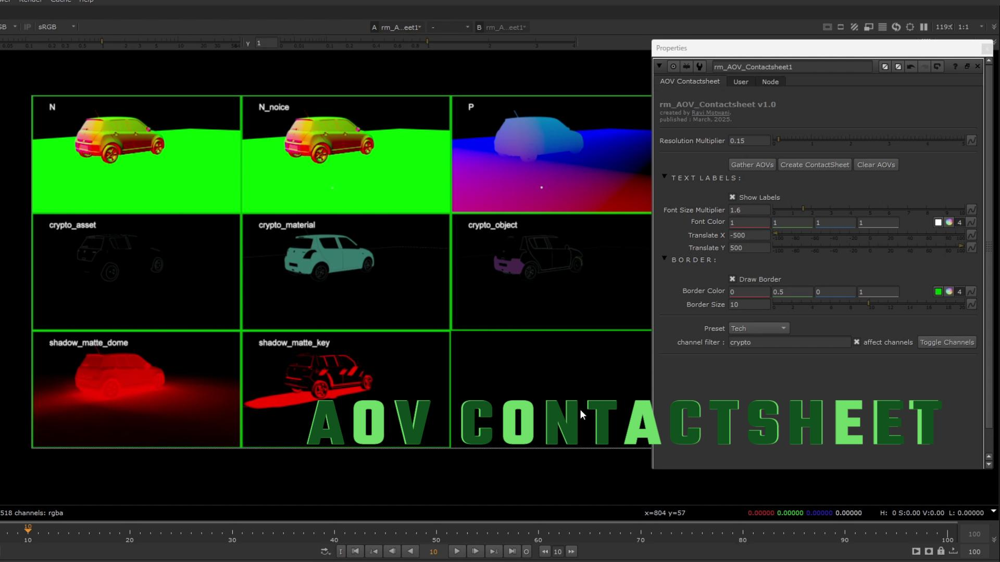

# rm_aov_contactsheet
A simple Nuke Gizmo for creating Contactsheet for AOVs/Channels. You can easily create the contactsheet for any multi-exr as AOVs are nothing but just channels.

# main features :
1) Create Contactsheet - Spreads out the AOVs/channels checked ON in the list.
2) AOVs/channels Names Options for render withing Contactsheet.

# detailed options :

1) Resolution Multiplier - Resolution scale for the contactsheet, which in case becomes too big in size so that can controlled with multiplier.

2) Gather AOVs - Analyse and provide tick boxes for all the AOVs/Channels of the connected input exr.

3) Create Contactsheet - Checks for all the ticked AOVs/channels of input exr and create contactsheet for the same.

4) Clear AOVs - Clear the AOVs list and revert back from contactsheet sheet to single image.

5) TEXT LABELS -

    a) Show Labels - Enable/Disable for AOVs/channels names.

    b) Font Multiplier - Font size multiplier to increase or reduce the size of a font.

    c) Font Color - Customize Color value for text.

    d) Translate X and Translate Y - move text in X or Y direction for flexibility and clarity.

6) BORDER -

    a) Draw Border - Enable/Diable for outer line for AOVs/channels.

    b) Border Color - Customize Color value for outerline.

    c) Border Size - Thickness for the outerline.

7) Preset - ALL, AOV_LIGHTS, AOV_SHADERS, TECH

Preset made as per the arnold renderer, can be edited by editing the gizmo in text editor and finding

T_AOV_LIGHTS, T_AOV_SHADERS, T_TECH, just add the channels in the variable.

8) channel filter , affect channels and Toggle Channels works together,

    a) channel filter - needs channels comman name like direct, indirect etc.

    eg : direct, indirect, specular ----> separate names with commas.

    b) affect channels - if its ticked yes than it will enable the ticks from the list and if its ticked no than will disable those.

    c) Toggle Channels - execution takes place this operation can be done with this button.

# Installation:
1. Its a Gizmo can be copied over to .nuke folder i.e. - C:\Users\<username>\.nuke
   Alternatively advance ways can be used.

# *Note* : 
If gets text font error then just open the gizmo with text editor of your choice and search "C:/Windows/Fonts/arial.ttf" and replace it with the font in your machine, this can likely come if using other OS or font missing.

