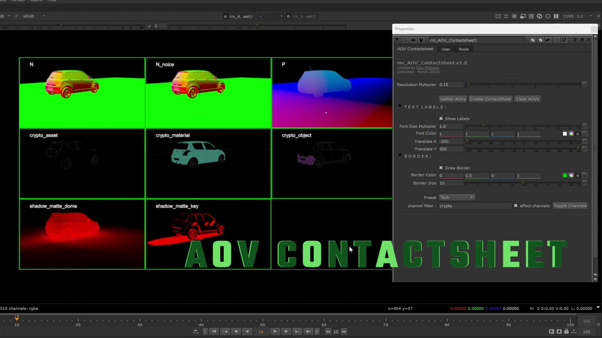

# rm_aov_contactsheet
A simple Nuke Gizmo for creating Contactsheet for AOVs/Channels. You can easily create the contactsheet for any multi-exr as AOVs are nothing but just channels.

# main features:
1) Create Contactsheet - Spreads out the AOVs/channels checked ON in the list.
2) AOVs/channels Names Options for render withing Contactsheet.

# detailed options:

1) Resolution Multiplier - Resolution scale for the contactsheet, which in case becomes too big in size so that can controlled with multiplier.

2) Gather AOVs - Analyse and provide tick boxes for all the AOVs/Channels of the connected input exr.

3) Create Contactsheet - Checks for all the ticked AOVs/channels of input exr and create contactsheet for the same.

4) Clear AOVs - Clear the AOVs list and revert back from contactsheet sheet to single image.

5) TEXT LABELS -

    a) Show Labels - Enable/Disable for AOVs/channels names.

    b) Global Font Scale - Font size multiplier to increase or reduce the size of a font.
	
	c) Translate: Allows for translation of the text within the contact sheet.

    d) Font Color - Customize Color value for text.

    e) Label Background Color: Provides a control to change the background color.
	
	f) Label Background Opacity: Adjusts the transparency for the text label background element in the contact sheet.

6) BORDER -

    a) Draw Border - Enable/Diable for outer line for AOVs/channels.

    b) Border Color - Customize Color value for outerline.

    c) Border Size - Thickness for the outerline.

7) Preset - ALL, AOV_LIGHTS, AOV_SHADERS, TECH, - None

Preset made as per the arnold renderer, can be edited by editing the gizmo in text editor and finding

T_AOV_LIGHTS, T_AOV_SHADERS, T_TECH, just add the channels in the variable.

8) channel filter , affect channels and Toggle Channels works together,

    a) channel filter - needs channels comman name like direct, indirect etc.

    eg : direct, indirect, specular ----> separate names with commas.

    b) affect channels - if its ticked yes than it will enable the ticks from the list and if its ticked no than will disable those.

    c) Toggle Channels - execution takes place this operation can be done with this button.

# Installation:
1. Copy the folder `gizmos` and `python` in your `.nuke` folder located at `C:\Users\<username>\.nuke`.
2. Copy the content of `init.py` in your `init.py` located at `C:\Users\<username>\.nuke` if the file already exists else copy the file directly.
3. Copy the content of `menu.py` in your `menu.py` located at `C:\Users\<username>\.nuke`
if the file already exists else copy the file directly.

## Usage:

To use `aov_contactsheet`, follow these steps:
1. Tab in nodes graph and select `AOVContactsheet` or select it through Nodes -> Other.
2. Connect the multi-exr read node for which you want to generate a contact sheet.
3. Press `Gather AOVs`, it will gather the AOVs info, check whichever AOVs you need with help of filter and Preset. 
3. Run / Execute the `Create Contactheet` Button.
4. Adjust the various controls to customize the appearance of the contact sheet as desired.

# Changelog:
################################### 25/05/2026 ######################################## 
### The script was in progress for updating with the bug fixes: 
### 1. duplicating the nodes errors for the links.
### 2. Adding text translate controls with background enable and background opacity.
### 3. Removed the dependency of text font selection if linux or windows.
### 4. Code cleanup for scalability.

## Contributing:
Contributions are welcome! If you find any bugs or have suggestions for new features, please submit an issue or pull request on our GitHub repository.

## License:
aov_contactsheet is released under the MIT License. For more details, see the LICENSE [blocked] file.